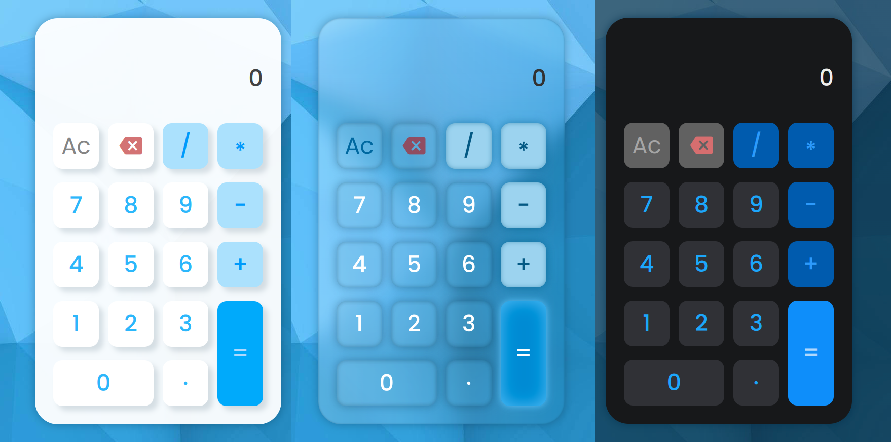

# Calculator
- [JavaScript Foundations project](https://www.theodinproject.com/lessons/foundations-calculator) on the [TOP](https://www.theodinproject.com/) curriculum.

## Preview

## Learning Goals
- Basic JavaScript
  - Loops
  - Functions
  - DOM Manipulations
  - Objects

- Basic CSS

### Credits
- Background image: [Wallpapers.com](https://wallpapers.com/wallpapers/low-poly-blue-background-5o6wzulr6o47bk0a.html)
- Calculator UI: Thanks to [Figma](https://www.figma.com/file/KArnfg50SaRrXc4rvJ75YM/Calculator-App-Ui-Design-Free)
- Title icon: [KindPNG.com](https://www.kindpng.com/imgv/iimmhRx_calculator-icon-calculator-app-icon-png-transparent-png/)
- Sound effects: [MixKit.co](https://mixkit.co/free-sound-effects/click/)
